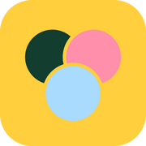

<p align="center">
  
</p>

<h1 align="center">Réunion</h1>

<p align="center">
  <strong>Réunir tout le monde, sans le casse-tête.</strong><br>
  Trouvez la bonne date pour les réunions de votre association, à partir des disponibilités de chacun.
</p>

<p align="center">
  
  
  
  
</p>

---

## Pourquoi Réunion ?

Caler une assemblée, un bureau ou un atelier dans une association, c'est souvent des dizaines de messages, un sondage oublié et des absents de dernière minute. Réunion part d'une idée simple : **chacun tient son calendrier de disponibilités à jour une fois pour toutes**, et l'application trouve les meilleurs créneaux pour chaque demande.

## Comment ça marche

1. **Chacun colorie ses disponibilités** sur une grille de 8 h à 22 h, par demi-heure : *sur place* (bleu) ou *à distance* (vert). Au clic, au glisser ou du bout du doigt, avec copie d'un jour sur la semaine et duplication d'une semaine sur la suivante.
2. **Une demande est lancée** dans un groupe : une période, une date butoir indicative. Les membres sont prévenus par e-mail.
3. **Le résumé trouve les meilleurs créneaux** selon la durée voulue, le nombre minimum de présents et le nombre minimum de personnes sur place.
4. **On valide une date, ou on fait voter** les membres sur plusieurs créneaux.
5. **Tout le monde est prévenu** : e-mail de confirmation, fichier agenda `.ics` et lien « Ajouter à Google Agenda ».

## Fonctionnalités

- **Calendrier personnel** de disponibilités, indépendant des groupes, saisissable jusqu'à 3 mois à l'avance, partagé par toutes les demandes.
- **Groupes** avec invitations par e-mail. Le créateur choisit qui peut faire une demande, inviter des membres et valider une date : lui seul ou tous les membres.
- **Résumé des meilleurs créneaux** (présents, sur place, à distance, absents) et **vote** en un clic, prérempli depuis la grille.
- **Réunions confirmées bloquées** dans le calendrier de chaque membre (cases « Réunion »), comptées comme indisponibles pour les autres demandes ; chacun peut **refuser** une réunion pour libérer son créneau.
- **Rappel automatique** la veille de la date butoir pour ceux qui n'ont pas encore répondu.
- **Connexion par e-mail ou avec Google**, double authentification et clés d'accès (passkeys).
- **Interface en français**, thèmes clair et sombre, utilisable au clavier et sur mobile ; toutes les heures sont celles de Paris.

## Technologies

| | |
|---|---|
| Back-end | [Laravel 13](https://laravel.com), PHP 8.4, [Fortify](https://laravel.com/docs/fortify), [Socialite](https://laravel.com/docs/socialite) |
| Interface | [Livewire 4](https://livewire.laravel.com), [Flux Pro](https://fluxui.dev), Alpine.js, [Tailwind CSS 4](https://tailwindcss.com), Vite |
| Tests | [Pest](https://pestphp.com) |
| Base de données | SQLite en local, MySQL ou SQLite en production |

> **Flux Pro** est un composant payant : une licence est nécessaire pour `composer install` (identifiants à configurer pour le dépôt `composer.fluxui.dev`).

## Installation locale

Prérequis : PHP 8.4, Composer, Node.js 20.19+ (ou 22+) et une licence Flux Pro.

```bash
git clone https://github.com/atome-dev/reunion.git
cd reunion
composer run setup   # dépendances, .env, clé, base SQLite, migrations, build front
composer run dev     # lance les processus de développement (serveur, Vite…)
```

L'application est alors disponible sur http://localhost:8000.

### Configuration (`.env`)

| Variable | Rôle |
|---|---|
| `APP_URL` | Adresse publique : liens des e-mails, agenda, retour Google |
| `APP_LOCALE` | `fr` |
| `APP_DISPLAY_TIMEZONE` | Fuseau d'affichage des horaires (défaut `Europe/Paris`) |
| `MAIL_*` | Serveur d'envoi des e-mails (`log` en local, ou Mailpit) |
| `GOOGLE_OAUTH_ID`, `GOOGLE_OAUTH_SECRET` | Connexion avec Google (facultatif) |

Pour la connexion Google, déclarez dans la Google Cloud Console l'adresse de retour exacte, par exemple `http://localhost:8000/auth/google/callback` en local (attention : `localhost` et `127.0.0.1` sont deux adresses différentes pour Google).

## Tests

```bash
php artisan test --compact
```

## Mise en production

Exemple avec [Laravel Forge](https://forge.laravel.com) :

- script de déploiement : `composer install --no-dev`, `php artisan migrate --force`, `npm ci && npm run build` ;
- **planificateur** activé (`php artisan schedule:run` chaque minute), indispensable pour les rappels ;
- variables d'environnement ci-dessus renseignées, avec l'adresse de retour Google de production ;
- aucune file d'attente nécessaire : les e-mails partent immédiatement.

## Licence

Réunion est un logiciel libre distribué sous [licence MIT](LICENSE).

## Auteur

**Nicolas Chauvet** — [Atome Dev](https://github.com/atome-dev)
